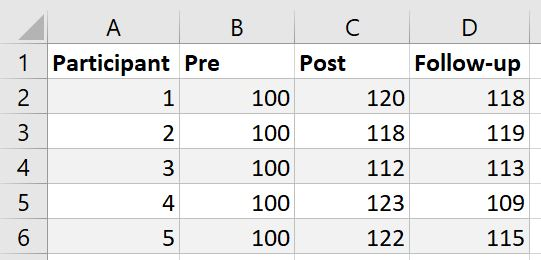
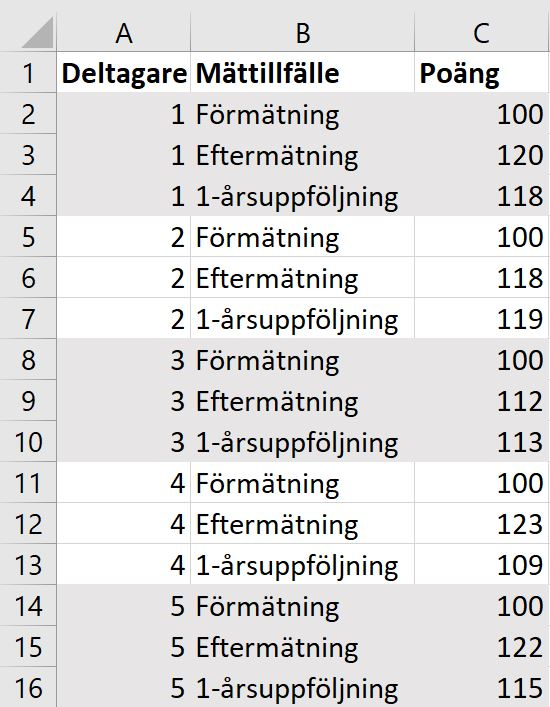

# Loading data into jamovi

You can load data into jamovi using either data files used in other statistical software (SPSS, Stata, SAS, JASP) or from textfiles (.txt or .csv files) with __comma delimited data__ (\@ref(csvData)). To be able to perform common analyses like t-test, ANOVA or regression, your data needs to be in the __wide format__ (\@ref(wideData)). When you have your wide data ready, __opening a file__ (\@ref(openFile)) file in jamovi is easy.

## Opening a file {#openFile}

1. Click the menu icon  in the top left corner.

2. Make sure that `This PC/Mac` is selected and click `Browse`

3. Locate your data file and click open.

## Comma delimited data {#csvData}

A comma delimited file has the filename extension .csv and contains unformated text, where cells are separated by a semi-colon (se picture below) or another special character. If your have your data in a spreadsheet program (e.g. Excel), you can create a csv-file of your data by selecting `File -> Save as...` and choose `Comma delimited` in the drop-down menu near the `Save as`-button.

  

## Breda data {#wideData}

Commonly, your data needs to be in the _wide format_. Wide data (se figure A below) means that every participant has one row only. This is contrast to the _long format_ (se figure B below) where each participant may have multiple rows.

  
Figur A: _Data in wide format._  

  
Figur B: _Data i long format._  
