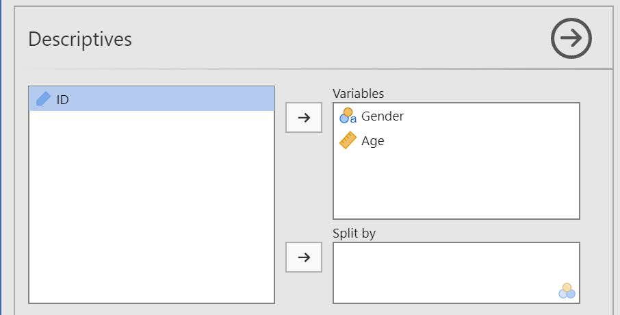
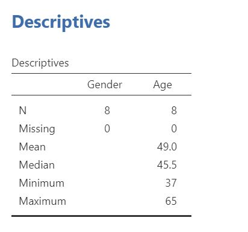

# Descriptive analyses {#descriptives}

This chapter provides an overview of how you perform descriptive analyses and create graphs. If you have not yet loaded and prepared your data, have a look at the previous chapter (\@ref(loadData)) first.

When you are ready to perform your descriptive analysis, follow the steps below:

1. Select `Analyses -> Exploration -> Descriptives`.  
 

2. Move the variables you want to descriptive analyses for to __Varibles__.  
 

3. The result is shown in the right panel. Right click the output to save or copy it.

4. To split your descriptive analyses on a categorical variable (e.g. separate by gender), move that variable to __Split by__.

5. Click the tab __Statistics__ to see more alternatives
 

6. To create a plot, click __Plots__ and tick a box to create a plot corresponding to your choices in step 2.
 
