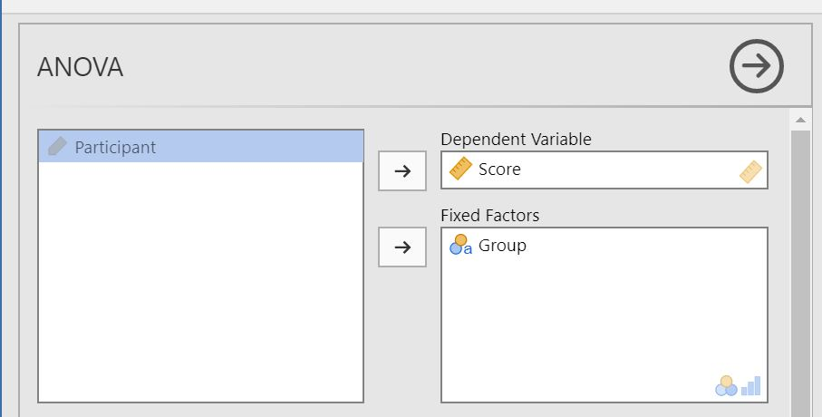
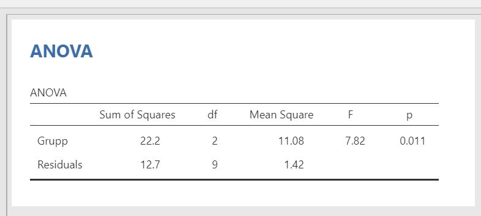
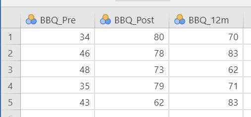
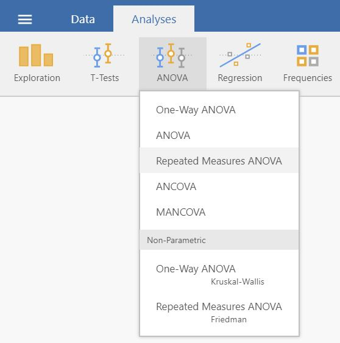
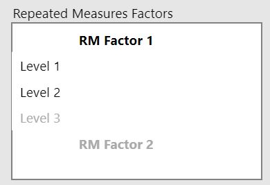
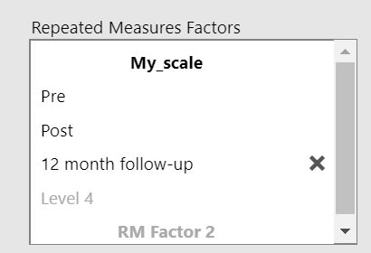
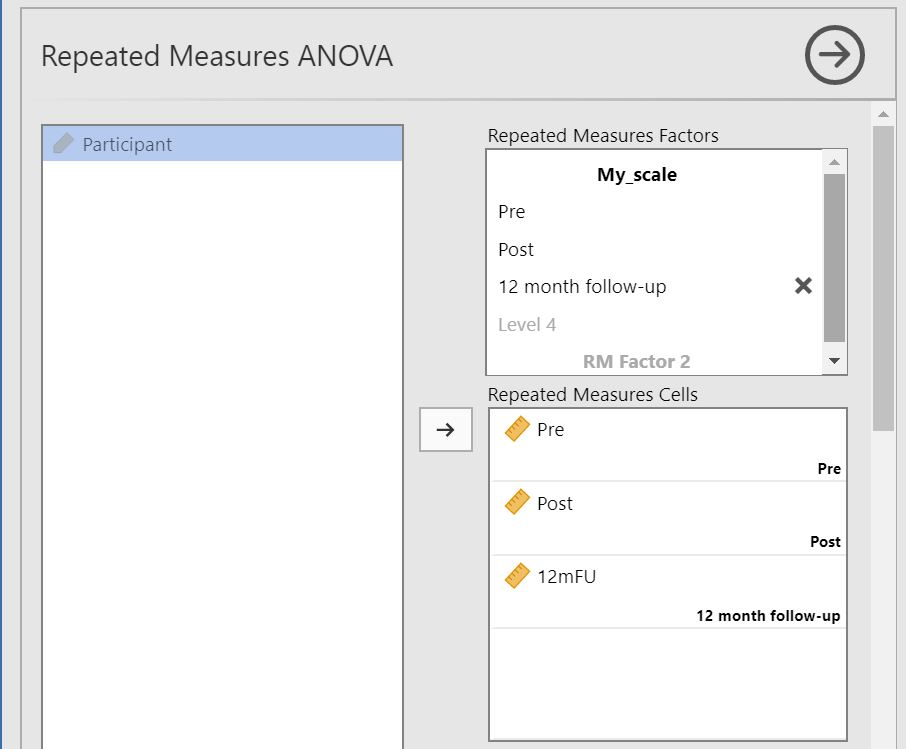
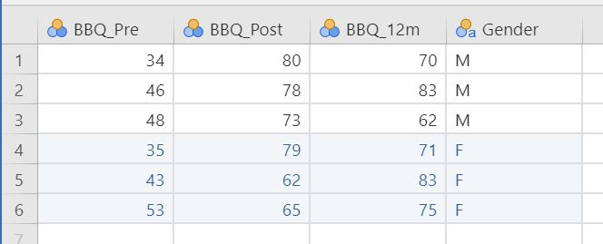
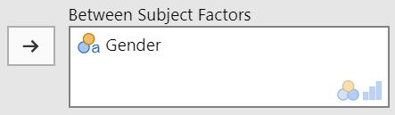
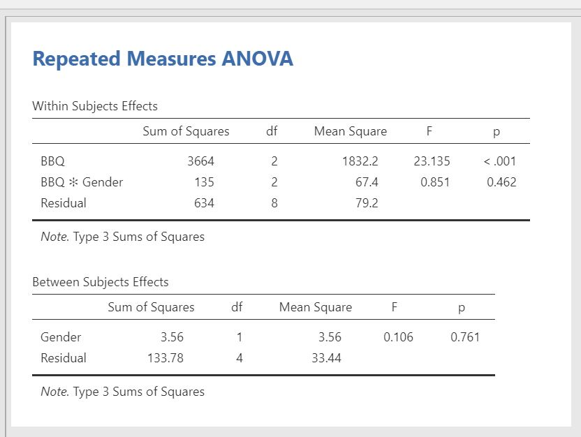

# ANOVA  

This chapter shows how to perform an ANOVA (\@ref(ANOVA)) and its extensions Factorial ANOVA (\@ref(factorialANOVA)), Repeated Measures ANOVA (\@ref(rmANOVA)), and Mixed ANOVA (\@ref(mixedANOVA)).

## ANOVA {#ANOVA}  

1. To perform a "simple" ANOVA you need a grouping variable and an outcome variable (continous). Therefore, your data should look something like this:  
  

2. Select `Analyses -> ANOVA -> ANOVA`.  
 

3. Move your outcome variable to __Dependent Variable__ and your grouping variable to __Fixed Factors__.  
 

4. The results is shown in the right pane:  
 

## Factorial ANOVA {#factorialANOVA}  

1. To perform a factorial ANOVA you need two grouping variables and an outcome variable (continous). Therefore, your data should look something like this:  
  

2. Select `Analyses -> ANOVA -> ANOVA`.  
 

3. Move your outcome variable to __Dependent Variable__ and your grouping variables to __Fixed Factors__.   
 

4. The result is shown in the right pane:  
 

## Repeated Measures ANOVA {#rmANOVA}  

1. To perform a Repeated Measures ANOVA you need an outcome variable (continous) where every measurement has its own column. Therefore, your data should look something like this:  
  

2. Select `Analyses -> ANOVA -> Repeated Measures ANOVA`.  
 

3. In the box __Repeated Measures Factors__: write the name of your outcome variable (e.g. BBQ) and name the levels for each measurement occasion (e.g. Pre, Post and 12 month follow-up). The below images illustrates this.  
 `->`  

4. Move your outcome variables to their respective cells in __Repeated Measures Cells__.  
 

5. The results are shown in the right pane:  
 

## Mixed ANOVA {#mixedANOVA}  

1. To perform a mixed ANOVA, you need a grouping variable and an outcome variable (continous) where each measurement occasion has its own column. Therefore, your data should look something like this:  
 

2. Select `Analyses -> ANOVA -> Repeated Measures ANOVA`.  
 

3.  In the box __Repeated Measures Factors__: write the name of your outcome variable (e.g. BBQ) and name the levels for each measurement occasion (e.g. Pre, Post and 12 month follow-up). The below images illustrates this.  
 `->`  

4. Move your outcome variables to their respective cells in __Repeated Measures Cells__.  
 

5. Move your grouping variables to __Between Subject Factors__.  
 

6. The result is shown in the right panel:  
 