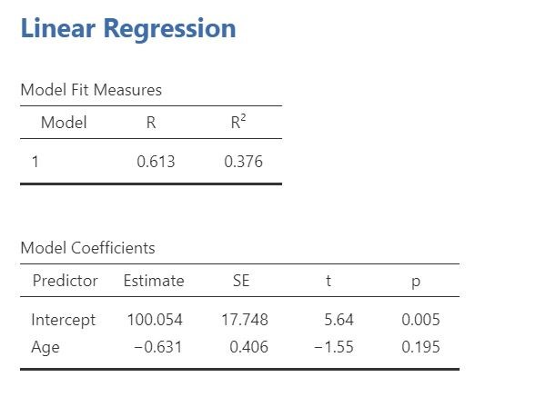
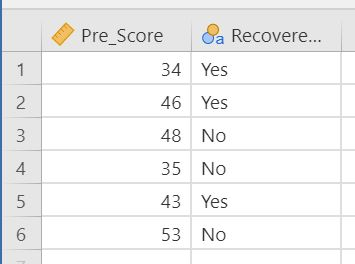
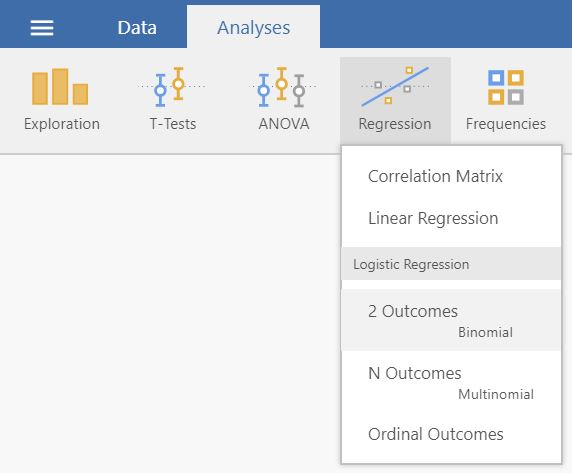

# Regression

This chapter shows how to perform linear (\@ref(linear)) and logistic (\@ref(logistic)) regressions

## Regression {#linear}  

1. To perform a linear regression you need two continous variables: one outcome variable and one predictor. Therefore, your data should look something like this:  
  

2. Select `Analyses -> Regression -> Linear Regression`.  
 

3. Move your outcome variable to __Dependent Variable__ and your predictor to __Covariates__. 
 

4. The result is shown in the right panel:  
 

## Logistic Regression {#logistic}  

1. To perform a logistic regression you need a continous predictor and a categorical outcome variable. Therefore, your data should look something like this:  
  

2. If the outcome variable has two levels (as in the above image): select `Analyses -> Regression -> 2 Outcomes `. If the outcome variable has three or more levels, select `Analyses -> Regression -> N Outcomes`.  
 

3. Move your outcome variable to __Dependent Variable__ and your predictor to __Covariates__.  
 

4. The result is shown in the right panel:  
 