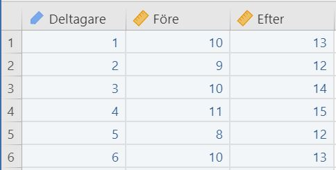

# T-Test: Paired samples {#paired-samples-t-test}

#### How to perform a paired samples t-test in jamovi: {-}

1. You need two continuous variables. Make sure that the measurement levels are set^[This is demonstrated in section \@ref(level-of-measurement).] so that both the continuous variables are marked with .  
A correct setup should look similar to this:  

2. Select `Analyses` -> `T-Tests` -> `Paired Samples T-Test`.  
 

3. Drag and drop your two outcome variables to __Paired Variables__.  
 

4. The result is shown in the right panel

