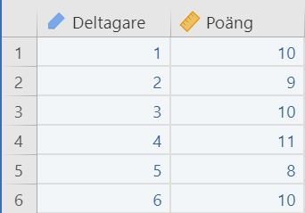
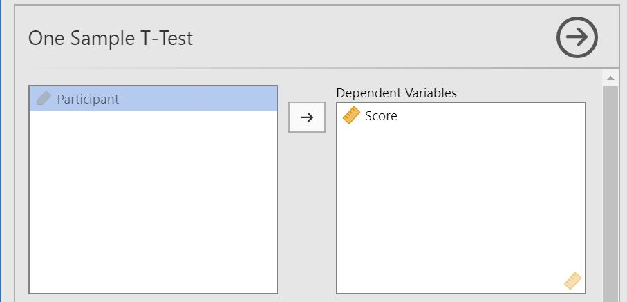

# T-Test: One sample {#one-sample-t-test}

##### How to perform a one-sample t-test in jamovi: {-}

1. You need one continuous variable and a mean to test against. Make sure that the continuous variable is marked with  (see section \@ref(level-of-measurement)).   
A correct setup should look similar to this:  
  

2. Select `Analyses` -> `T-Tests` -> `One Sample T-Test`.  
 

3. Drag and drop your dependent variable to __Dependent Variables__.  
 

4. Locate the section __Hypothesis__ further down, this is where you enter the mean you want to test against.  
 

5. The result is shown in the right panel

