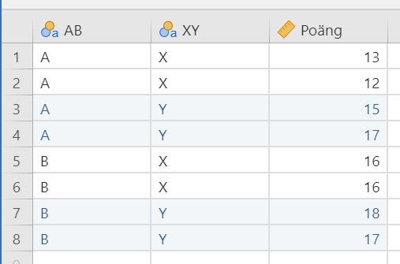
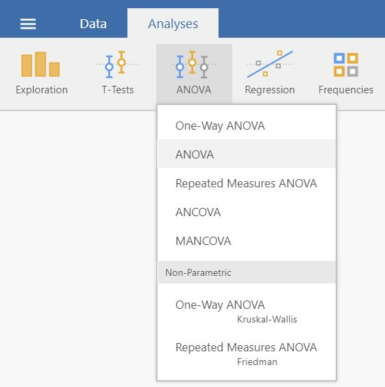
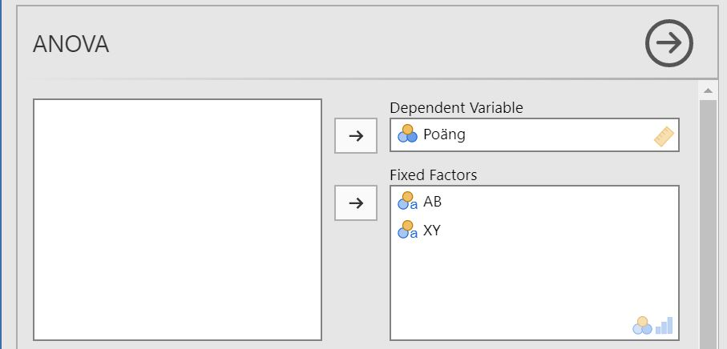
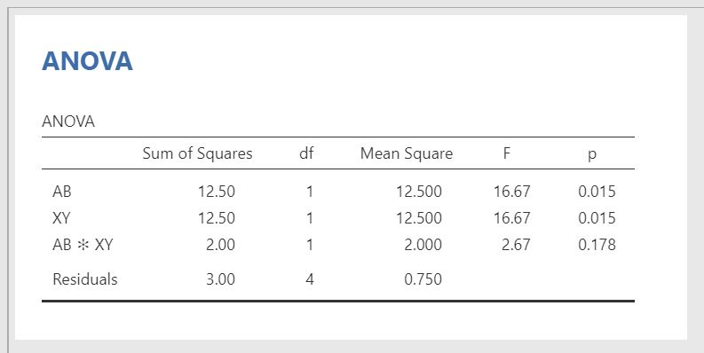

# ANOVA: Factorial {#factorial-anova}  

#### How to perform a factorial ANOVA in jamovi: {-}

1. You need two grouping variables and one continuous outcome variable. Make sure that the measurement levels are set^[This is demonstrated in section \@ref(level-of-measurement).] so that the grouping variables are marked with  and the continuous variable is marked with .  
A correct setup should look similar to this:  
  

2. Select `Analyses` -> `ANOVA` -> `ANOVA`.  
 

3. Drag and drop your outcome variable to __Dependent Variable__ and your grouping variables to __Fixed Factors__.   
 

4. The result is shown in the right pane:  
 

